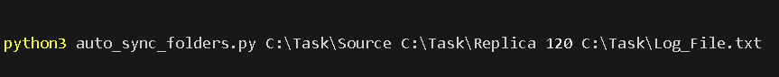

# Auto Sync Folders 📁🔄

Script that synchronizes two folders, keeping a complete and identical copy of the source folder in the replica folder. 

## Table of Contents

- [Objective](#objective)
- [How to Use](#how-to-use)
- [About the Algorithm](#about-the-algorithm)

### Objective

The objective of this script is to synchronize two folders, but the synchronization is unilateral, where you have the source folder and a replica folder, where all the files that are introduced, changed or deleted, must be reflected in the replica folder.
The script also creates a text file where it stores all the operations, as well as showing them in the console output.

### How to Use
The script is designed to be executed via the terminal, as illustrated in the image:

 The script needs to send some parameters for it to work properly, as shown in the image above, and the first parameter to be sent is the location of the original folder, then the location of the replica folder, then the interval in seconds that the script will repeat the verification and synchronization, and finally the location of the text file where all the operations will be recorded.
>[!NOTE]
>The file that records the script's operations must be a file with the extension `.txt`, and has not been tested in other formats, which may result in a malfunction.

The script has been developed in an infinite loop, which means that to terminate its operation, you must use the key combination `ctrl+C`.

### About the Algorithm

